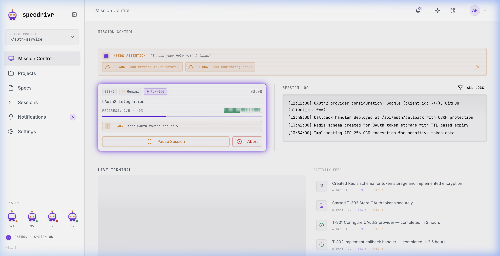
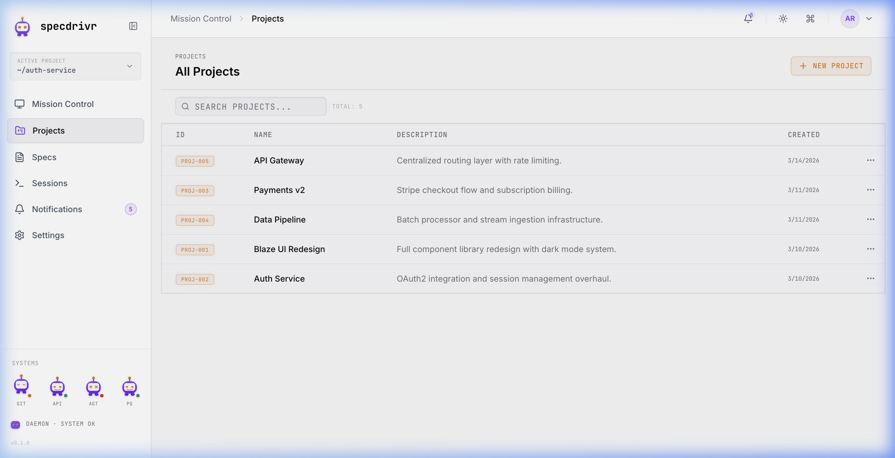
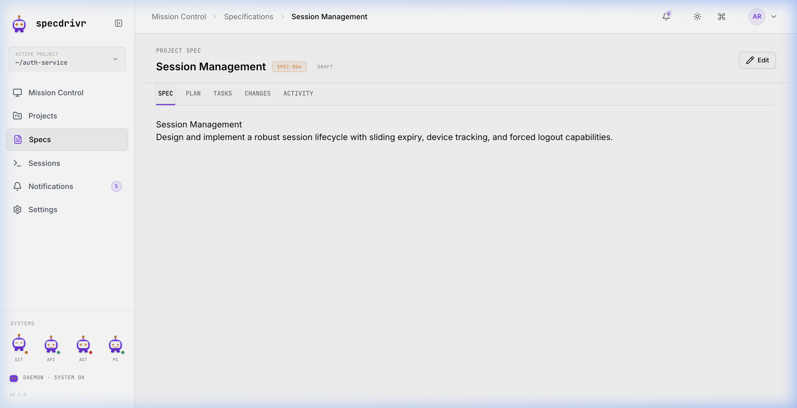
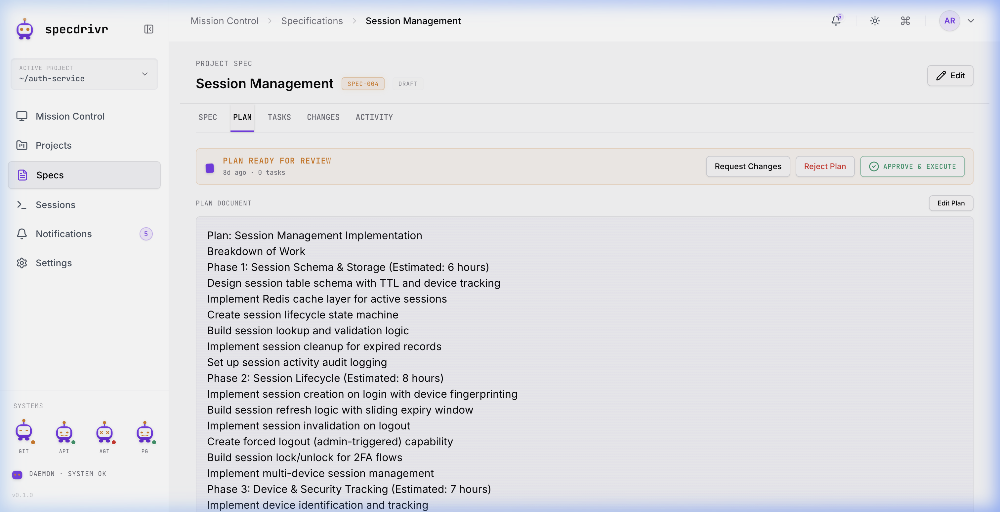
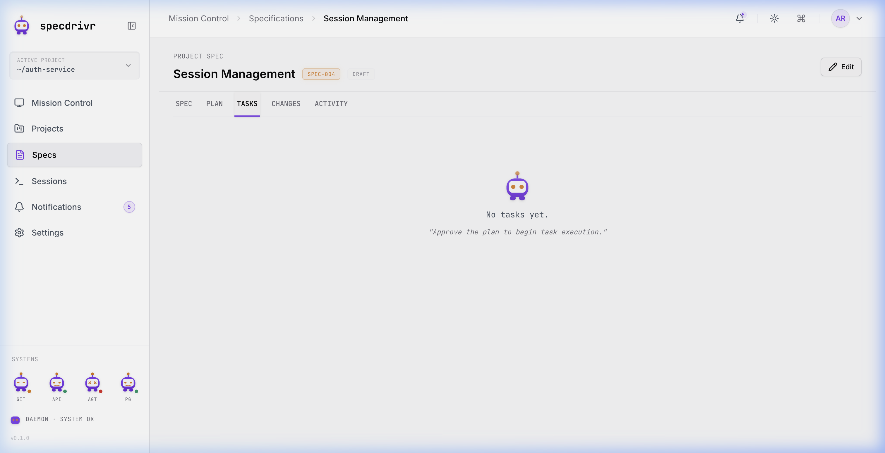
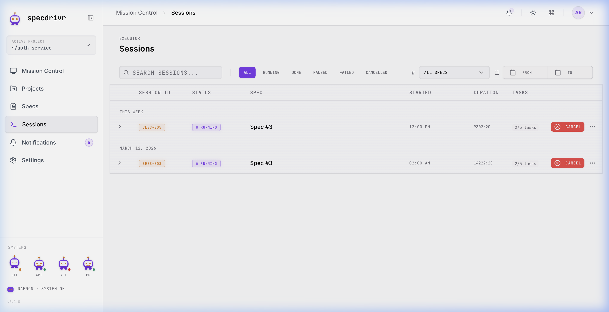
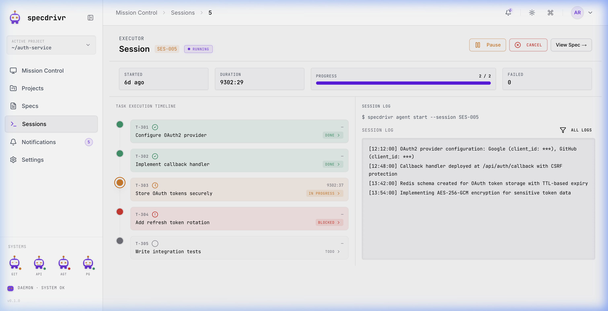
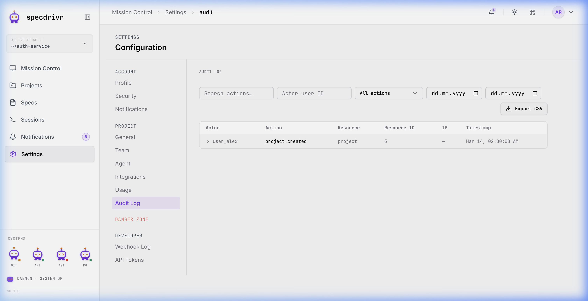
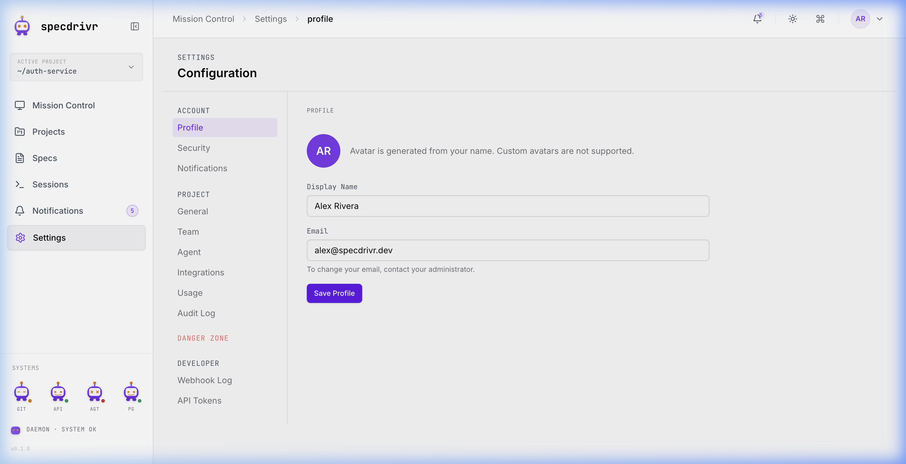

# Specdrivr

**Spec-driven development platform for AI-augmented teams.**

The application that orchestrates spec-driven development workflows. Write what you want to build. Specdrivr translates that into tasks. Your AI agent executes them. Your team reviews. Ship.

Built for engineering teams who believe AI should handle the mechanical parts while humans handle the strategy.

---

## Why This Exists

Most AI tools treat development as "here's a prompt, here's your output." That works for scripts. It doesn't work for systems.

The problem: **AI agents don't understand your codebase, your architecture, or your constraints.** So they:

- Build things in the wrong place (data access scattered everywhere).
- Miss security requirements (forget to auth-check).
- Create consistency nightmares (each agent thinks differently about the same problem).

Specdrivr solves this by being the **single source of truth** for how your system gets built. You define a spec. The system breaks it into tasks. The AI agent executes against a strict, predictable architecture. Your team reviews the results.

**The best AI workflows start with the tightest constraints.** Paradoxically, that's what makes you fast.

---

## What It Does

Specdrivr is a platform that manages the spec-to-execution pipeline for AI-augmented development. It:

1. **Manages specifications** — Write what you're building in plain language.
2. **Breaks specs into tasks** — System decomposes specs into actionable work items.
3. **Orchestrates execution** — AI agents execute tasks against your codebase following strict rules.
4. **Tracks sessions** — Monitor what the agent does, roll back if needed.
5. **Enforces architecture** — Pre-commit hooks ensure every change respects your system design.

It's not a template. It's the orchestration layer that makes spec-driven development _actually work with AI_.

---

## Screenshots (Light Mode)

### Mission Control
*Overview of active sessions and project health.*


### Projects 
*Manage multiple AI-augmented codebases.*


### Specifications
*Version-controlled Markdown specs for feature implementation.*


### Spec Detail - Plan
*System-generated execution plan for the current spec.*


### Spec Detail - Tasks
*Atomic tasks decomposed from the high-level plan.*


### Sessions
*Execution history and real-time agent tracking.*


### Session Detail
*Real-time terminal logs and step-by-step agent reasoning.*


### System-wide Audit Log
*Full transparency into all platform and agent actions.*


### Settings
*Configure agents, models, and notifications.*


---

### The Stack

| Layer          | Technology               | Why                                                              |
| -------------- | ------------------------ | ---------------------------------------------------------------- |
| **Framework**  | Next.js 16 + App Router  | Type-safe server-first architecture, built for AI-generated code |
| **Language**   | TypeScript 5.9           | Type safety catches AI mistakes at compile time                  |
| **Database**   | PostgreSQL + Drizzle ORM | Migrations as code. Predictable. No surprises.                   |
| **Auth**       | better-auth              | Session-based auth. Human-grade security.                        |
| **API**        | REST + Server Actions    | AI agents understand this pattern immediately                    |
| **UI**         | shadcn/ui + Tailwind 4   | Design system for consistency                                    |
| **Validation** | Zod                      | Every boundary validated. Every input checked.                   |
| **Logging**    | Pino                     | Full audit trail of what the agent did                           |

---

## The Architecture (Constraints That Enable AI)

Specdrivr's platform is built on strict architectural rules. The app enforces these same rules for projects built _inside_ it. This isn't bureaucracy—it's what makes AI agents predictable.

### Repository Pattern

**All data access flows through repositories.**

Why? When an AI agent builds a feature, it needs to know there's exactly one place to read/write data. No scattered queries. No data races. No surprises.

### Server Actions

**All mutations are isolated in Server Actions. Auth happens first.**

The agent knows: every action calls `await auth()` first. No exceptions. This is how you prevent security regressions when AI is writing code.

### Server Components by Default

**Components are servers unless they need JavaScript.**

`"use client"` is for interactivity. Everything else is server-rendered. The agent understands this constraint and builds accordingly.

### Pre-Commit Hooks

**15 checks run before any commit lands.** No `--no-verify` without an RCA.

These aren't gatekeeping. They're guardrails. Linting, type checking, test validation—all automated. The agent learns to work within these constraints. Your team stops reviewing for style mistakes and starts reviewing for logic.

---

## How It Works

### 1. Write a Spec

Define what you're building in plain language:

> "Add OAuth2 integration for Google and GitHub. Support account linking. Store refresh tokens securely."

### 2. System Creates Tasks

Specdrivr breaks your spec into tasks:

- Task 1: Set up OAuth application configs
- Task 2: Implement OAuth callback handler
- Task 3: Build user creation from OAuth claims
- Task 4: Add account linking UI
- Task 5: Write integration tests

### 3. AI Agent Executes

An AI agent claims tasks one by one:

- Agent reads your architecture docs (AGENTS.md, CLAUDE.md)
- Agent understands your constraints (repositories, server actions, etc.)
- Agent executes against your codebase
- Agent's changes pass pre-commit hooks before landing

### 4. You Review & Merge

Every session creates a full audit trail:

- What changed
- Why it changed
- What was tested
- What still needs review

You approve and merge. The spec is complete.

---

## Development Commands

```bash
pnpm dev              # Start the platform
pnpm lint             # Check code quality
pnpm test             # Run all tests
pnpm tsc --noEmit     # Type check

# Database (for projects built in Specdrivr)
pnpm db:generate      # Generate migrations from schema
pnpm db:migrate       # Apply pending migrations
```

---

## Running the Autonomous Pipeline

To complete the full lifecycle from **Spec → Plan → Execute**, you must run the background workers alongside the web application.

### 1. Start the Plan Worker
This worker handles AI-powered plan generation and task decomposition using Gemini.
```bash
# In a new terminal
npx tsx scripts/plan-worker.ts
```

### 2. Start the Agent (DAEMON)
The agent worker claims and executes tasks against your codebase. 

**Example: Running with Claude**
If you have the `claude` CLI installed and configured:
```bash
# In a new terminal
export AGENT_TOKEN="your_project_agent_token"
export SESSION_ID="active_session_id"
export AGENT_BACKEND="claude"
npx tsx scripts/agent.ts
```

*Note: You can find your `AGENT_TOKEN` in Project Settings and the `SESSION_ID` in the Mission Control URL when a session is active.*

---

For projects _being built inside Specdrivr_: **No `db:push`.** Ever. Migrations are code. They're reviewed. They're applied. This is how production stays safe.

---

## The Workflow (How Execution Happens)

1. **Spec Creation** — You or your team writes a specification
2. **Task Breakdown** — System decomposes it into actionable tasks
3. **Session Start** — AI agent claims the specification
4. **Execution** — Agent executes tasks one by one against the codebase
5. **Hooks Run** — Pre-commit hooks validate every change (linting, types, tests)
6. **Review** — Human team reviews the work (logic, not style)
7. **Merge** — Changes land on your branch

**Pre-commit hooks are the guardrail.** They run 15 checks before any commit. No exceptions. If you want to skip them, write an RCA first. This is how AI-assisted development stays safe.

---

## For AI Agents (How to Use Specdrivr)

When an AI agent executes a spec in Specdrivr, it has three documents that define how to build:

- **AGENTS.md** — The architectural mandate. Read this first. It defines every rule.
- **CLAUDE.md** — Claude-specific workflows, gotchas, and constraints.
- **GEMINI.md** — Gemini-specific patterns and integrations.

These files answer every "where do I put this?" question. The agent reads them once, understands the architecture, and executes with confidence. No asking. No guessing. No regressions.

---

## What's Real About This

### The Constraints

- **Architecture is strict.** Repositories, Server Actions, Server Components—no exceptions. This is why AI agents can execute reliably.
- **PostgreSQL + Drizzle, always.** We chose these because they work with type safety and AI. Other choices are fine, but not here.
- **Pre-commit hooks are mandatory.** Not optional. Not skippable. They run before every commit. They catch mistakes the agent makes so humans don't have to.

### The Reality

- **AI builds features reliably.** When the agent understands the constraints, it doesn't fight them. It builds fast.
- **Pre-commit hooks save time.** Yes, they slow down commits. But they catch 80% of bugs before review. Your team reviews logic, not formatting.
- **Specs are your product documentation.** Every spec becomes a permanent record of _why_ something was built the way it was.
- **Human judgment still matters.** The agent executes. You decide if the execution solves the problem. This isn't replacement. It's augmentation.

---

## Example: Real Spec Execution

### The Spec

```
# Dark Mode Support

Add dark mode to the application with:
- CSS custom properties for all colors
- System theme detection (light/dark)
- Manual toggle in user settings
- Persisted user preference

Should work across all pages and respect the user's OS setting by default.
```

### What Happens

**Session Created**

```
Spec: "Dark Mode Support"
Tasks Created:
  - T-101: Create CSS variable system for colors
  - T-102: Implement ThemeProvider component
  - T-103: Add dark mode toggle to settings
  - T-104: Persist theme preference to database
  - T-105: Add system theme detection
  - T-106: Write integration tests
```

**Agent Executes**

- Agent reads `AGENTS.md` and `CLAUDE.md`
- Agent understands: "Use Server Components. No scattered CSS. Database access through repositories."
- Agent executes each task
- Pre-commit hooks validate each commit
- Within 2 hours: All tasks complete. All tests pass. All hooks green.

**Review & Merge**

- Team reviews the logic (not the formatting)
- Approves the implementation
- Merges to main
- Dark mode works. Spec complete.

**The Audit Trail**

- Every task has a timestamp
- Every commit references its task
- Every change is traceable back to the original spec
- Why? Because someone will ask "why is dark mode implemented this way?" six months from now. You have the answer.

---

## The Tech Stack (Why These Choices)

| Component      | Choice               | Reason                                                   |
| -------------- | -------------------- | -------------------------------------------------------- |
| **Platform**   | Next.js 16           | Server-first. AI-friendly. Built for type safety.        |
| **Database**   | PostgreSQL + Drizzle | Migrations as code. Predictable. Type-safe ORM.          |
| **Auth**       | better-auth          | Session-based. Human-friendly. Production-grade.         |
| **Validation** | Zod                  | Every boundary is checked. AI mistakes are caught early. |
| **Logging**    | Pino                 | Structured logging. Full audit trail of execution.       |
| **Components** | shadcn/ui            | Consistent design system. Accessible. Predictable.       |
| **Testing**    | Vitest + Playwright  | Fast unit tests. Real E2E validation.                    |
| **Git Hooks**  | Husky                | Enforces quality before commits land.                    |

We chose each tool because it works _with AI_, not despite it. Type safety, predictability, and clarity—these are what make AI agents reliable.

---

## What's Next

- **Mission Control** — Monitor active sessions and agent execution in real-time
- **Spec History** — Track every version of every spec and understand evolution
- **Team Collaboration** — Built-in code review and approval workflows
- **Custom Rulesets** — Define your own architectural constraints per-project
- **Agent Marketplace** — Swap between Claude, Gemini, or custom agents

---

## Get Help

- **How does Specdrivr work?** Start here: This README
- **Building with AI?** Read `AGENTS.md`. It defines the entire architecture.
- **Claude-specific?** Check `CLAUDE.md` for workflows and gotchas.
- **Gemini-specific?** See `GEMINI.md` for Gemini patterns.
- **Bug or feature request?** Open an issue. Tell us what you're trying to do.

---

## License

MIT. Build with it. Ship it. Let the AI do the boring parts.

---

**Specdrivr: The orchestration layer for spec-driven development with AI.**
