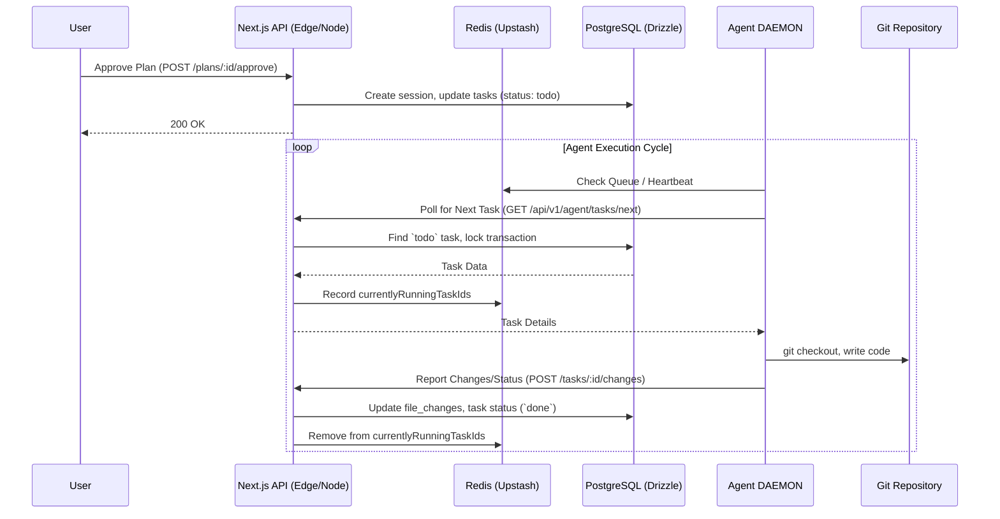

**SPECDRIVR**

Master Product Specification

Version 1.0 · Confidential

_Spec-driven autonomous code execution for engineering teams_

# **4\. System Architecture**

## **4.1 Technology Stack**

| **Layer**          | **Technology / Library**                          | **Rationale**                                                           |
| ------------------ | ------------------------------------------------- | ----------------------------------------------------------------------- |
| Framework          | Next.js 16 (App Router)                           | Server Components, Server Actions, built-in caching layer               |
| Language           | TypeScript 5.x (strict mode)                      | Type safety across all layers; Drizzle types flow end-to-end            |
| Database           | PostgreSQL 16                                     | ACID transactions; JSONB for log lines and metadata                     |
| ORM                | Drizzle ORM + drizzle-kit                         | Type-safe queries; schema-first migrations; no code generation          |
| Auth               | [Better Auth](https://www.better-auth.com/)       | Credentials + Email/Password; session in httpOnly cookie; CSRF built-in |
| Cache / Queues     | Redis (ioredis)                                   | Rate limiting; agent task queue; production-grade TCP client |
| File storage       | S3-compatible (AWS or self-hosted MinIO)          | Spec attachments; diff snapshots for long sessions                      |
| Email              | Resend                                            | Transactional email for invites, notifications, password reset          |
| UI components      | shadcn/ui (Radix + Tailwind)                      | Accessible, unstyled primitives; customisable without overrides         |
| Animation          | Motion (Framer Motion v11)                        | DAEMON expressions; page transitions; boot sequence                     |
| Drawer             | Vaul                                              | Task detail drawer; same author as shadcn; superior snap-point UX       |
| Syntax highlight   | Shiki                                             | Server-side diff rendering; vesper theme; zero client JS weight         |
| Sanitization       | DOMPurify (isomorphic-dompurify)                  | Mandatory sanitization for all Markdown/Spec rendering                  |
| Markdown editor    | @uiw/react-codemirror + @codemirror/lang-markdown | CodeMirror 6 in React; live preview; line numbers                       |
| Terminal           | @xterm/xterm + @xterm/addon-fit                   | Real ANSI terminal rendering; auto-scroll; same engine as VS Code       |
| Keyboard shortcuts | react-hotkeys-hook                                | Declarative shortcut binding; respects focus traps                      |
| Toasts             | Sonner                                            | shadcn-native toast library; DAEMON sprite support                      |
| Validation         | Zod                                               | Single source of truth for input schemas; shared client/server          |
| Logging            | Pino                                              | Structured JSON logs; correlation IDs; never logs PII                   |
| Testing (unit)     | Vitest                                            | Fast; native ESM; mocks Drizzle without Postgres in CI                  |
| Testing (e2e)      | Playwright                                        | ARIA-first locators; auth state reuse; shard-parallel CI                |

## **4.2 Deployment Architecture**

- Next.js application deployed on Vercel or a Node.js container (Docker image provided)
- PostgreSQL on managed provider (Supabase, Neon, RDS, or self-hosted)
- Redis 7+ (self-hosted, Docker, or managed provider)
- DAEMON agent runtime: a separate long-running Node.js process that polls the task queue from Redis and executes against the repository via git + language-specific tooling
- The DAEMON agent authenticates to the Specdrivr API using an API token (AGENT_TOKEN environment variable). It never connects directly to the database.
- S3 bucket or MinIO instance for spec attachments and large diff storage

## **4.3 Security Boundaries**

- The web application (Next.js) never exposes database credentials to the client. All DB access goes through Server Actions or Route Handlers on the server only.
- lib/db.ts, lib/env.ts, and lib/logger.ts all carry import 'server-only' - any accidental client import is a compile-time error.
- The DAEMON agent communicates via the public API only. No direct DB access from the agent process.
- User sessions are stored in the database (Postgres) with a 30-day TTL. Revoking a session deletes the record immediately.
- API tokens are stored as bcrypt hashes. The raw token is shown exactly once (on creation) and cannot be recovered.

# **23\. Stack-Specific Engineering Constraints**

This section documents known pitfalls and required mitigations for the specific technology choices made in this project. Every item here represents a failure mode that will occur in production if not addressed during development.

## **23.1 Next.js 16 App Router**

| **Pitfall**                                                                                                                                                                                                                      | **Mitigation**                                                                                                                                                                                                                                                                |
| -------------------------------------------------------------------------------------------------------------------------------------------------------------------------------------------------------------------------------- | ----------------------------------------------------------------------------------------------------------------------------------------------------------------------------------------------------------------------------------------------------------------------------- |
| Server Component / Client Component boundary confusion: useEffect, useState, and event handlers cannot be used in Server Components. Accidentally importing a client library in a Server Component causes a cryptic build error. | Establish a naming convention: components in app/ that are purely data-fetching are Server Components by default. Add "use client" explicitly at the top of any component file that uses hooks or handles events. Never use "use client" in a component that fetches DB data. |
| Aggressive caching in App Router: fetch() calls inside Server Components are cached by default. Mutations that happen via Route Handlers or Server Actions will not invalidate the cache automatically.                          | Call revalidatePath('/specs') or revalidateTag('specs') at the end of every Server Action that mutates data. Define consistent cache tags in a central lib/cache-keys.ts. Never rely on the default fetch cache for mutable data.                                             |
| Server Actions and optimistic updates: without React Query, managing optimistic state requires useOptimistic from React 19. Rollback on error must be handled explicitly.                                                        | Use useOptimistic for all task status changes and notification reads. Always include the error rollback path. Server Actions throw on failure - catch in the calling component.                                                                                               |
| Streaming and Suspense: if a page uses async Server Components with Suspense, a slow DB query blocks the entire page until resolved.                                                                                             | Wrap independently-loadable sections in &lt;Suspense fallback={<Skeleton /&gt;}>. Spec detail page should stream the header immediately while the tabs load. Do not nest Suspense boundaries in a way that waterfalls queries - fetch in parallel with Promise.all.           |

## **23.2 Drizzle ORM**

| **Pitfall**                                                                                                                                                                                                              | **Mitigation**                                                                                                                                                                                                                                                          |
| ------------------------------------------------------------------------------------------------------------------------------------------------------------------------------------------------------------------------ | ----------------------------------------------------------------------------------------------------------------------------------------------------------------------------------------------------------------------------------------------------------------------- |
| Missing transactions: multi-table writes in Server Actions that are not wrapped in db.transaction() will leave the database in a partial state if the second write fails.                                                | Every Server Action that writes to more than one table MUST use db.transaction(async (tx) => { ... }). The transaction callback receives a tx object - all writes inside must use tx, not the global db. Partial writes are the hardest bug to reproduce in production. |
| N+1 queries: fetching a list of specs and then fetching the plan for each one in a loop.                                                                                                                                 | Use Drizzle's relational query API (db.query.specs.findMany({ with: { plan: true } })) for joined fetches. Check query counts in dev mode with the pg query logging enabled.                                                                                            |
| Drizzle singleton in serverless: creating a new PgPool on every Lambda invocation exhausts connection limits within minutes.                                                                                             | lib/db.ts must use the global pattern: const globalDb = global as any; if (!globalDb.db) { globalDb.db = drizzle(pool); } export const db = globalDb.db;. Use pg-pool with max: 5 to limit connections per instance.                                                    |
| Type drift between schema and runtime: Drizzle types inferred from schema are the source of truth. If you add a column to the DB without updating schema.ts, TypeScript will not catch queries that miss the new column. | Never write raw SQL migrations by hand. Always use drizzle-kit generate → drizzle-kit migrate. schema.ts is the single source of truth. CI must run drizzle-kit check to verify schema is not out of sync.                                                              |

## **23.3 Redis / ioredis**

| **Pitfall**                                                                                                                              | **Mitigation**                                                                                                                                                |
| ---------------------------------------------------------------------------------------------------------------------------------------- | ------------------------------------------------------------------------------------------------------------------------------------------------------------- |
| Connection pooling and reconnection: ioredis must be initialized as a singleton with connection pooling to avoid exhausting connection limits. | Use global singleton pattern in lib/redis.ts. Implement proper error handling and reconnection strategies. Connection pool should be shared across all routes. |
| Redis keys: rate limiting and queue management.                                                                                          | Prefix all keys: ratelimit:{ip}:{endpoint}, queue:task:{taskId}. Never store a bare key.                                                                      |
| Rate limit bypass via header spoofing: using X-Forwarded-For as the rate limit key allows clients to spoof IP addresses.                 | Extract real IP from Vercel's trusted x-vercel-forwarded-for header in production. In development, fall back to req.ip. Never trust X-Forwarded-For directly. |

## **23.4 Plan Generation as a Long-Running Job**

Plan generation cannot be implemented as a synchronous Route Handler on serverless infrastructure. Vercel Lambda has a maximum execution time of 60 seconds (Pro) or 300 seconds (Enterprise). Plan generation for complex specs can exceed 30 seconds.

| **Option**                                      | **Trade-offs**                                                                                                                                                                      |
| ----------------------------------------------- | ----------------------------------------------------------------------------------------------------------------------------------------------------------------------------------- |
| Upstash QStash (recommended)                    | HTTP-based background job queue. POST a job to QStash; it calls back your /api/internal/plan-generate webhook. Serverless-compatible. Handles retries. Dead-letter queue available. |
| Vercel Edge Functions with streaming            | Can stream responses but still has a 30s CPU time limit. Does not work for Claude API calls which may take longer.                                                                  |
| Dedicated background worker (Node.js container) | Most reliable. Polls a Redis queue for plan generation jobs. Required if self-hosting. Adds infrastructure complexity.                                                              |

The chosen approach must be documented in lib/jobs/plan-generator.ts. The plan generation job writes status updates directly to the DB (spec.status = "pending_plan" → tasks inserted one by one) so the frontend can display incremental progress via polling.

## **23.5 xterm.js (Client-Side Only)**

| **Pitfall**                                                                                                                                                                         | **Mitigation**                                                                                                                                                                                                                                       |
| ----------------------------------------------------------------------------------------------------------------------------------------------------------------------------------- | ---------------------------------------------------------------------------------------------------------------------------------------------------------------------------------------------------------------------------------------------------- |
| SSR crash: xterm.js accesses document and window on import. Next.js SSR will crash if it is imported in a Server Component or without dynamic().                                    | Always import: const Terminal = dynamic(() => import('@/components/Terminal'), { ssr: false }). Never import xterm directly in a Server Component.                                                                                                   |
| Canvas z-index bleeding through Vaul drawer: xterm.js renders via an HTML &lt;canvas&gt; element. Canvas elements can bleed through CSS z-index stacking contexts on some browsers. | Wrap each xterm instance in a div with transform: translateZ(0) to create a new stacking context. In the Task Drawer, pause xterm rendering (terminal.element.style.visibility = 'hidden') when the drawer is closed to prevent off-screen repaints. |
| Memory leak: each Terminal instance holds a WebGL rendering context. Creating terminal instances without disposing them on unmount will exhaust GPU memory.                         | Always call terminal.dispose() in the useEffect cleanup function. Use a ref to track the Terminal instance across renders.                                                                                                                           |
| Auto-scroll conflict: if the user has scrolled up to review history and DAEMON writes a new log line, auto-scrolling to the bottom disrupts the review.                             | Track isAtBottom state: terminal.onScroll(() => { isAtBottom = terminal.buffer.active.viewportY + terminal.rows >= terminal.buffer.active.length - 1 }). Only call terminal.scrollToBottom() if isAtBottom === true when a new line arrives.         |

## **23.6 Shiki Diff Rendering**

| **Pitfall**                                                                                                                       | **Mitigation**                                                                                                                                                                        |
| --------------------------------------------------------------------------------------------------------------------------------- | ------------------------------------------------------------------------------------------------------------------------------------------------------------------------------------- |
| Highlighter re-initialization: createHighlighter() is async and expensive. Calling it on every render causes significant latency. | Create a singleton in lib/shiki.ts using the module-level caching pattern. The singleton is shared across all Server Component renders in the same process.                           |
| Large diffs crash the browser: diffs with > 10,000 lines sent as a single Shiki render will freeze the main thread.               | If diff.split('\\n').length > 5000, render the first 2500 lines and the last 500 lines with a "… N lines omitted …" bridge. The full diff remains available via the API for download. |
| Language detection mismatch: Shiki requires the correct language identifier. Unknown file types will fail to highlight.           | Use the language field from file_changes (set by agent on upload). If language is null or unknown, fall back to "text" - never throw on unknown language.                             |

## **23.7 Polling vs Server-Sent Events**

The spec currently uses 3-second polling for session state and notifications. This is correct for the initial implementation. The following considerations apply:

| **Concern**                                                                                                                     | **Resolution**                                                                                                                                                                                                                                                             |
| ------------------------------------------------------------------------------------------------------------------------------- | -------------------------------------------------------------------------------------------------------------------------------------------------------------------------------------------------------------------------------------------------------------------------- |
| Poll when tab is hidden: polling continues when the user switches tabs, wasting bandwidth and server resources.                 | Add document.addEventListener("visibilitychange") to all polling intervals. Pause polling when document.hidden === true. Resume immediately on visibility restore with a forced re-fetch to catch up.                                                                      |
| Poll thundering herd: if many users have the app open during a popular session, polling creates a spike of concurrent DB reads. | Add ±500ms jitter to all polling intervals (setInterval(fn, 3000 + Math.random() \* 500)). This spreads load across the 3-second window.                                                                                                                                   |
| SSE upgrade path: a future version should replace polling with Server-Sent Events for live session log streaming.               | The GET /api/v1/sessions/:id/stream endpoint (specified in Section 6.10) is the SSE upgrade path. The client switches to SSE only when a session is active; polling remains for idle state. Do not implement SSE in v1 unless polling proves insufficient in load testing. |

## **23.8 Motion (Framer Motion) with Vaul**

| **Pitfall**                                                                                                                                                                                | **Mitigation**                                                                                                                                                                                       |
| ------------------------------------------------------------------------------------------------------------------------------------------------------------------------------------------ | ---------------------------------------------------------------------------------------------------------------------------------------------------------------------------------------------------- |
| Exit animations conflict with Vaul's DOM removal: Vaul removes the drawer from the DOM on close. If a Motion animate on unmount is running, Framer will throw because the element is gone. | Wrap Vaul's content in AnimatePresence with mode="wait". All exit animations must complete within 200ms (Vaul's default close duration). Use custom={...} to pass close state into the exit variant. |
| DAEMON sprite layout shift: when DAEMON expression changes, a layout animation can cause surrounding text to jump.                                                                         | Apply layout="size" only on the DAEMON sprite container, not on the parent flex row. Never use layout on text elements adjacent to DAEMON.                                                           |

## **23.9 pnpm Package Manager**

| **Pitfall**                                                                                                                                                                                        | **Mitigation**                                                 |
| -------------------------------------------------------------------------------------------------------------------------------------------------------------------------------------------------- | -------------------------------------------------------------- |
| Dependency vulnerabilities in transitive dependencies. `pnpm audit` reveals moderate vulnerabilities in build tools like esbuild that are not directly fixable by upgrading the direct dependency. | Use `pnpm.overrides` in package.json to force secure versions. |

```json
{
  "pnpm": {
    "overrides": {
      "esbuild": "^0.25.0"
    }
  }
}
```

Example: commit 33a0f48 fixed an esbuild vulnerability via pnpm overrides. Always address security warnings from `pnpm audit` before deployment.
| CI/CD pipelines using `npm ci` instead of pnpm commands. The project enforces pnpm and deletes package-lock.json (commit 99bb6ea). | Update GitHub Actions workflows to use `pnpm install --frozen-lockfile` (not `npm ci`). All package scripts must use `pnpm` commands exclusively.
| Type errors and undefined environment variables in CI environments. | Validate all environment variables with Zod in lib/env.ts. Run TypeScript compilation in CI: `tsc --noEmit` to catch type errors before deployment (commit 3eb626b).|

## **23.10 Better Auth Implementation Patterns**

| **Target**                                                                                        | **Best Practice**                                                                                                                 |
| ------------------------------------------------------------------------------------------------- | --------------------------------------------------------------------------------------------------------------------------------- |
| Session retrieval in Server Components: the data returned by auth() is reactive to the DB record. | Always use `const session = await auth();` from `src/lib/auth.ts`. It wraps the Better Auth client for internal use.              |
| Middleware session check: the edge session check in proxy.ts is restricted to cookie existence.   | `proxy.ts` performs a fast existence check for `better-auth.session_token`. Cryptographic verification happens in Route Handlers. |
| User metadata and roles: the `users` table is extended with custom fields like `role`.            | Access roles via `session.user.role`. This is populated via the `additionalFields` configuration in `src/lib/auth.ts`.            |
| API Route endpoints: authentication logic is unified under a single catch-all route.              | Use `/api/auth/[...auth]` handled by `toNextJsHandler`. Do not implement manual sign-in routes.                                   |

# **24\. Concurrency & Race Condition Handling**

The following scenarios represent real concurrent-user conflicts that will occur in production. Each requires an explicit server-side resolution strategy - optimistic locking or last-write-wins is not acceptable for any of these cases.

## **24.1 Concurrent Plan Approval**

Scenario: two admins both click \[Approve & Execute\] within milliseconds of each other. Without a guard, two agent sessions would be created for the same plan.

Resolution: use a Postgres advisory lock or an UPDATE with WHERE status = 'pending_approval' returning id. The approve Server Action must:

- BEGIN TRANSACTION.
- UPDATE plans SET status = 'approved', approvedAt = now(), approvedBy = userId WHERE id = planId AND status = 'pending_approval' RETURNING id.
- If no row returned: the plan was already approved. Return HTTP 409 with code CONFLICT and message "This plan was already approved by another reviewer."
- If row returned: create agent_session in the same transaction. COMMIT.

The UI must handle HTTP 409 on this endpoint by showing an amber Sonner toast ("This plan was approved moments ago by \[Name\]") and refreshing the plan state.

## **24.2 Spec Edit While Executing**

Scenario: a Member opens the spec editor while DAEMON is actively executing tasks on that spec.

Resolution: the server does NOT block the edit. The spec editor shows a red sticky banner: "⚠ DAEMON is currently executing tasks on this spec. Saving will create a new version and abandon the running session." The \[Save Draft\] button is replaced by \[Save & Abandon Session\] - which requires the user to type "ABANDON" in a confirmation field. The underlying save logic calls db.transaction() to update the spec version and set agent_sessions.status = 'cancelled' atomically.

## **24.3 Concurrent Spec Editors**

Scenario: two users both have /specs/\[id\]/edit open and both click \[Save Draft\] within seconds.

Resolution: optimistic locking via specVersionId. The edit form includes a hidden field: lastVersionId = spec.currentVersionId (set when the editor was loaded).

The save Server Action runs: UPDATE specs SET currentVersionId = newVersionId WHERE id = specId AND currentVersionId = lastVersionId RETURNING id. If no row returned, the version changed under the user - return HTTP 409. The UI presents a \[Merge Editor\] modal showing the conflicting content side-by-side with a diff view. The user must choose a resolution or merge manually. The server never auto-merges spec content.

## **24.4 Task Retry During Active Session**

Scenario: user clicks \[RE-RUN\] on a task while the session is actively executing other tasks. The retry queues the task, but the session may also have scheduled it.

Resolution: tasks are picked up by the agent by querying SELECT \* FROM tasks WHERE planId = :planId AND status = 'todo' AND NOT (id = ANY(currentlyRunningTaskIds)) ORDER BY executionOrder LIMIT maxConcurrentTasks. The currentlyRunningTaskIds set is maintained in Redis (key: session:{sessionId}:running). A task retry simply sets status = 'todo' - the agent's next poll cycle picks it up naturally. No separate queue operation is needed.

## **24.5 Notification Delivery on Member Role Change**

Scenario: Admin removes Member from a project while Member has an active session. Member's requests should immediately return 403.

Resolution: all project-scoped endpoints check project_members status and role on every request (not cached in the session token). Caching membership in the JWT is not acceptable - role changes must take effect immediately. The session token contains only userId; role is always fetched fresh from the DB per request. This is a deliberate performance trade-off: one extra DB read per request vs stale permission data.

## **24.6 Session Heartbeat Race**

Scenario: the agent sends a heartbeat, and simultaneously the user clicks \[Cancel\] - the heartbeat response says shouldStop: true, but the agent has already started the next task.

Resolution: the agent MUST check the heartbeat response before executing each task, not just at the heartbeat interval. The task execution loop is: 1) send heartbeat, 2) if shouldStop → exit loop, 3) pick up next task. The heartbeat is the only mechanism for stopping a session - never kill the agent process externally.

## **4.4 Sequence & Data Flow**

The system employs an event-driven flow for AI task execution, utilizing PostgreSQL as a central state machine and Redis for queues and rate limiting.



## **4.5 Frontend State Management**

Frontend state is managed explicitly to distinguish between persistent global state and ephemeral UI state.

1. **Server Components:** The default for data fetching. Data is passed as props to Client Components.
2. **React Context:** Used sparingly for truly global application state (e.g., Theme, current active Project).
3. **Local State (useState/useReducer):** Ephemeral UI interactions (e.g., form inputs, dropdown visibility).
4. **URL State (searchParams):** Filters, search queries, and pagination are stored in the URL. This ensures sharable links and survives reloads.
5. **Zustand (Optional/Planned):** If complex client-side state is required in the future (like a multi-step wizard), a lightweight global store like Zustand is preferred over Redux.

## **4.6 Edge Runtime Constraints & Race Conditions**

**Edge Runtime (proxy.ts):**

- Specdrivr uses Next.js Edge for middleware/proxy routing.
- Native Node.js modules, globals (`process.cwd`), and raw TCP connections (`ioredis`) are unsupported at the Edge.
- Rate limiting and session verification use ioredis with proper connection pooling and error recovery.

**Race Condition Handling (PostgreSQL State Machine):**

- Specdrivr relies on database-level row locks (`SELECT ... FOR UPDATE`) and optimistic concurrency control.
- Distributed locking via Redis (`src/lib/lock-manager.ts`) is used for task assignment to prevent multiple agent instances from picking up the same task simultaneously.
- Concurrent updates to the same entity (e.g., Spec edits) use versioning logic to ensure idempotency and prevent lost updates.
