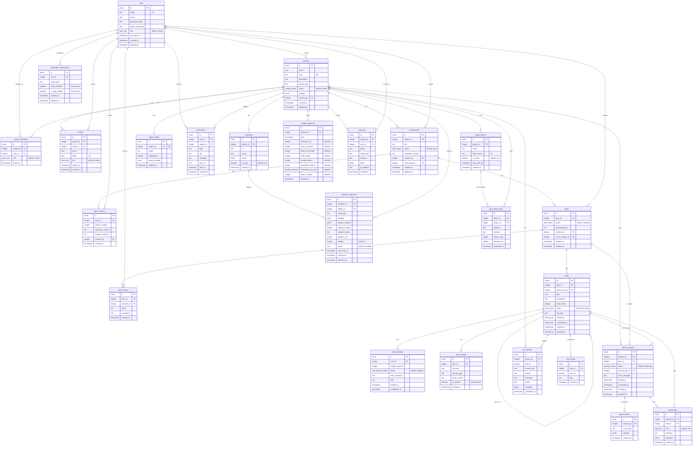

# Database Entity Relationship Diagram

This diagram represents the PostgreSQL database schema defined in `src/db/schema.ts`, capturing the core domain entities for the Spec-Drivr application.

```mermaid
erDiagram
    users {
        serial id PK
        text email "UK"
        text name
        text password_hash
        text github_username
        user_role role "default: viewer"
        timestamp last_login_at
        timestamp created_at
        timestamp updated_at
    }

    projects {
        serial id PK
        text name
        text slug "UK"
        text description
        text github_repo
        project_status status "default: active"
        jsonb settings
        integer created_by FK
        timestamp created_at
        timestamp updated_at
    }

    project_members {
        serial id PK
        integer project_id FK
        integer user_id FK
        user_role role "default: viewer"
        timestamp joined_at
    }

    invites {
        serial id PK
        integer project_id FK
        integer inviter_id FK
        text email
        text token "UK"
        user_role role "default: viewer"
        timestamp expires_at
        timestamp created_at
    }

    agent_tokens {
        serial id PK
        integer project_id FK
        text name
        text token_hash "UK"
        boolean is_active "default: true"
        timestamp last_used_at
        timestamp created_at
    }

    specifications {
        serial id PK
        integer project_id FK
        text title
        spec_status status "default: draft"
        text markdown_content
        integer created_by FK
        integer active_plan_id FK
        timestamp created_at
        timestamp updated_at
    }

    spec_versions {
        serial id PK
        integer spec_id FK
        integer version_number
        text markdown_content
        text change_summary
        integer created_by FK
        timestamp created_at
    }

    plans {
        serial id PK
        integer spec_id FK
        plan_status status "default: pending"
        text generated_plan
        integer created_by FK
        integer active_session_id FK
        timestamp created_at
        timestamp updated_at
    }

    plan_reviews {
        serial id PK
        integer plan_id FK
        integer reviewer_id FK
        text status
        text comments
        timestamp created_at
    }

    tasks {
        serial id PK
        integer plan_id FK
        integer parent_task_id FK
        text title
        text description
        integer order_index
        task_status status "default: pending"
        text file_path
        timestamp started_at
        timestamp completed_at
        timestamp created_at
        timestamp updated_at
    }

    task_attempts {
        serial id PK
        integer task_id FK
        integer attempt_number
        task_attempt_status status "default: pending"
        text error_message
        text logs
        timestamp started_at
        timestamp completed_at
    }

    file_changes {
        serial id PK
        integer task_id FK
        text file_path
        text change_type
        text patch_content
        boolean is_verified "default: false"
        timestamp created_at
    }

    agent_sessions {
        serial id PK
        integer project_id FK
        integer plan_id FK
        session_status status "default: initializing"
        integer current_task_id FK
        text error_message
        timestamp started_at
        timestamp completed_at
        timestamp created_at
        timestamp updated_at
    }

    agent_events {
        serial id PK
        integer session_id FK
        text event_type
        jsonb payload
        timestamp created_at
    }

    agent_logs {
        serial id PK
        integer session_id FK
        integer task_id FK
        log_level level "default: info"
        text message
        jsonb metadata
        timestamp created_at
    }

    agent_config {
        serial id PK
        integer project_id FK "UK"
        text model
        integer temperature
        jsonb system_prompt
        timestamp updated_at
    }

    notifications {
        serial id PK
        integer user_id FK
        integer project_id FK
        text type
        text title
        text message
        text link_url
        timestamp read_at
        timestamp created_at
    }

    notification_preferences {
        serial id PK
        integer user_id FK
        text event_type
        boolean email_enabled "default: true"
        boolean in_app_enabled "default: true"
        timestamp created_at
        timestamp updated_at
    }

    webhooks {
        serial id PK
        integer project_id FK
        text url
        text secret
        jsonb events
        boolean is_active "default: true"
        timestamp created_at
    }

    webhook_deliveries {
        serial id PK
        integer webhook_id FK
        integer project_id FK
        text event_type
        jsonb payload
        jsonb request_headers
        integer response_status
        text response_body
        integer duration_ms
        integer attempt "default: 1"
        text status "default: pending"
        timestamp next_retry_at
        timestamp created_at
        timestamp delivered_at
    }

    usage_snapshots {
        serial id PK
        integer project_id FK
        timestamp date
        integer sessions_run "default: 0"
        integer tasks_executed "default: 0"
        integer tasks_succeeded "default: 0"
        integer tasks_failed "default: 0"
        integer prompt_tokens "default: 0"
        integer completion_tokens "default: 0"
        double_precision estimated_cost_usd "default: 0"
        integer specs_created "default: 0"
        timestamp created_at
    }

    git_commits {
        serial id PK
        integer project_id FK
        integer task_id FK
        text commit_sha
        text branch
        text message
        text author
        jsonb metadata
        timestamp committed_at
    }

    api_request_logs {
        serial id PK
        integer token_id FK
        integer project_id FK
        text endpoint
        text method
        integer status_code
        integer duration_ms
        timestamp requested_at
    }

    audit_log {
        serial id PK
        integer project_id FK
        integer user_id FK
        text action
        text target_type
        text target_id
        jsonb detail
        text ip_address
        timestamp created_at
    }

    test_results {
        serial id PK
        integer task_id FK
        boolean success
        text logs
        timestamp created_at
    }

    %% Relationships
    users ||--o{ projects : "creates"
    users ||--o{ project_members : "belongs_to"
    projects ||--o{ project_members : "has"
    projects ||--o{ invites : "has"
    users ||--o{ invites : "creates"
    projects ||--o{ agent_tokens : "has"
    projects ||--o{ specifications : "has"
    users ||--o{ specifications : "creates"
    specifications ||--o{ spec_versions : "has"
    users ||--o{ spec_versions : "creates"
    specifications ||--o{ plans : "has"
    users ||--o{ plans : "creates"
    plans ||--o{ plan_reviews : "has"
    users ||--o{ plan_reviews : "reviews"
    plans ||--o{ tasks : "has"
    tasks ||--o{ tasks : "parent_of"
    tasks ||--o{ task_attempts : "has"
    tasks ||--o{ file_changes : "has"
    projects ||--o{ agent_sessions : "has"
    plans ||--o{ agent_sessions : "executes"
    tasks ||--o{ agent_sessions : "current_task"
    agent_sessions ||--o{ agent_events : "generates"
    agent_sessions ||--o{ agent_logs : "logs"
    tasks ||--o{ agent_logs : "logs"
    projects ||--|| agent_config : "has"
    users ||--o{ notifications : "receives"
    projects ||--o{ notifications : "triggers"
    users ||--o{ notification_preferences : "configures"
    projects ||--o{ webhooks : "has"
    webhooks ||--o{ webhook_deliveries : "triggers"
    projects ||--o{ webhook_deliveries : "triggers"
    projects ||--o{ usage_snapshots : "tracks"
    projects ||--o{ git_commits : "has"
    tasks ||--o{ git_commits : "triggers"
    agent_tokens ||--o{ api_request_logs : "authenticates"
    projects ||--o{ api_request_logs : "logs"
    projects ||--o{ audit_log : "audits"
    users ||--o{ audit_log : "performs"
    tasks ||--o{ test_results : "generates"
```
