# Database Entity Relationship Diagram

[Status: GROUND TRUTH]

This diagram represents the canonical PostgreSQL database schema defined in `src/db/schema.ts`. It includes core domain entities, Better Auth authentication tables, and the orchestration engine metadata.

```mermaid
erDiagram
    %% --- Authentication ---
    users {
        text id PK
        text name
        text email "UK"
        text password_hash
        text avatar_url
        text timezone
        text locale
        integer onboarding_step
        text theme
        user_role role
        boolean is_active
        boolean email_verified
        timestamp created_at
        timestamp updated_at
        timestamp last_active_at
    }

    sessions {
        text id PK
        timestamp expires_at
        text token "UK"
        text ip_address
        text user_agent
        text user_id FK
        timestamp created_at
        timestamp updated_at
    }

    accounts {
        text id PK
        text account_id
        text provider_id
        text user_id FK
        text access_token
        text refresh_token
        text id_token
        timestamp access_token_expires_at
        timestamp refresh_token_expires_at
        text scope
        text password
        timestamp created_at
        timestamp updated_at
    }

    verifications {
        text id PK
        text identifier
        text value
        timestamp expires_at
        timestamp created_at
        timestamp updated_at
    }

    %% --- Core Domain ---
    projects {
        serial id PK
        text name
        text slug "UK"
        text description
        text repository_url
        text repository_branch
        text avatar_color
        boolean is_demo
        project_status status
        text created_by FK
        timestamp created_at
        timestamp updated_at
    }

    project_members {
        serial id PK
        integer project_id FK
        text user_id FK
        user_role role
        text status
        timestamp invited_at
        timestamp joined_at
        timestamp created_at
    }

    invites {
        serial id PK
        integer project_id FK
        text email
        user_role role
        text token "UK"
        text invited_by FK
        integer resend_count
        timestamp last_resent_at
        timestamp expires_at
        timestamp used_at
        timestamp created_at
    }

    agent_tokens {
        serial id PK
        text user_id FK
        integer project_id FK
        text name
        text token_hash "UK"
        text prefix
        timestamp expires_at
        timestamp last_used_at
        timestamp revoked_at
        timestamp created_at
    }

    %% --- Specification Engine ---
    specifications {
        serial id PK
        integer project_id FK
        text name
        spec_status status
        integer current_version_id
        text created_by FK
        timestamp created_at
        timestamp updated_at
    }

    spec_versions {
        serial id PK
        integer spec_id FK
        integer version_number
        text markdown_content
        text created_by FK
        timestamp created_at
    }

    plans {
        serial id PK
        integer spec_id FK
        integer spec_version_id FK
        plan_status status
        text markdown_content
        text reviewer_notes
        timestamp approved_at
        text approved_by FK
        integer generation_duration_ms
        text generation_error
        text model_version
        integer task_count
        integer total_estimated_minutes
        text created_by FK
        timestamp created_at
    }

    plan_reviews {
        serial id PK
        integer plan_id FK
        text user_id FK
        text action
        text notes
        timestamp created_at
    }

    tasks {
        serial id PK
        integer plan_id FK
        integer spec_id FK
        text external_id
        text title
        text description
        task_status status
        text_array depends_on
        integer execution_order
        text blocked_reason
        text human_context
        boolean forced_done
        integer attempt_count
        integer current_attempt_id
        boolean verification_passed
        integer estimated_minutes
        integer actual_duration_ms
        text git_branch
        text git_commit_hash
        text_array expected_files
        text agent_version
        integer prompt_tokens_used
        integer completion_tokens_used
        double total_cost_usd
        text recommended_model
        timestamp started_at
        timestamp completed_at
        timestamp created_at
        timestamp updated_at
    }

    task_attempts {
        serial id PK
        integer task_id FK
        integer seq
        task_attempt_status status
        jsonb log_lines
        text agent_version
        integer prompt_tokens_used
        integer completion_tokens_used
        integer exit_code
        text working_directory
        text error_message
        timestamp started_at
        timestamp ended_at
    }

    file_changes {
        serial id PK
        integer task_id FK
        integer attempt_id FK
        text file_path
        text change_type
        text diff
        boolean is_binary
        text language
        integer size_bytes
        integer lines_added
        integer lines_removed
        text previous_hash
        text new_hash
        timestamp created_at
    }

    %% --- Runtime & Execution ---
    agent_sessions {
        serial id PK
        integer spec_id FK
        integer plan_id FK
        integer project_id FK
        session_status status
        integer current_task_id
        timestamp last_heartbeat_at
        integer tasks_executed
        integer tasks_succeeded
        integer tasks_failed
        integer total_prompt_tokens
        integer total_completion_tokens
        double total_cost_usd
        integer pause_count
        text agent_version
        text git_base_branch
        text git_base_commit
        text git_head_commit
        text error_message
        text started_by FK
        timestamp started_at
        timestamp ended_at
    }

    agent_events {
        serial id PK
        integer session_id FK
        integer spec_id FK
        integer task_id FK
        text user_id FK
        text event_type
        text message
        jsonb metadata
        timestamp created_at
    }

    agent_logs {
        serial id PK
        integer task_id FK
        integer session_id FK
        integer project_id FK
        log_level level
        boolean is_internal
        text message
        jsonb context
        timestamp timestamp
    }

    agent_config {
        serial id PK
        integer project_id FK "UK"
        text model_id
        text plan_model_id
        integer max_concurrent_tasks
        integer task_timeout_seconds
        integer max_retries_per_task
        integer retry_delay_seconds
        boolean require_approval
        boolean auto_generate_plan
        text branch_prefix
        text commit_message_prefix
        text_array allowed_file_globs
        text_array forbidden_file_globs
        text test_command
        text lint_command
        text setup_command
        integer max_diff_size_kb
        boolean pr_auto_create
        text pr_target_branch
        text github_token
        text github_repo
        text github_branch
        text github_webhook_secret
        text slack_bot_token
        text slack_channel_id
        timestamp created_at
        timestamp updated_at
    }

    %% --- Observability & Ops ---
    notifications {
        serial id PK
        text user_id FK
        text type
        text title
        text body
        text link_url
        timestamp read_at
        text actor_user_id FK
        integer project_id FK
        text resource_type
        text resource_id
        timestamp created_at
    }

    notification_preferences {
        serial id PK
        text user_id FK
        text event_type
        boolean email_enabled
        boolean in_app_enabled
        timestamp created_at
        timestamp updated_at
    }

    webhooks {
        serial id PK
        integer project_id FK
        text url
        text secret
        jsonb events
        boolean is_active
        text status
        timestamp created_at
    }

    webhook_deliveries {
        serial id PK
        integer webhook_id FK
        integer project_id FK
        text event_type
        jsonb payload
        jsonb request_headers
        integer response_status
        text response_body
        integer duration_ms
        integer attempt
        text status
        timestamp next_retry_at
        timestamp created_at
        timestamp delivered_at
    }

    usage_snapshots {
        serial id PK
        integer project_id FK
        timestamp date
        integer sessions_run
        integer tasks_executed
        integer tasks_succeeded
        integer tasks_failed
        integer prompt_tokens
        integer completion_tokens
        double estimated_cost_usd
        integer specs_created
        timestamp created_at
    }

    git_commits {
        serial id PK
        integer project_id FK
        integer task_id FK
        text commit_sha
        text branch
        text message
        text author
        jsonb metadata
        timestamp committed_at
    }

    api_request_logs {
        serial id PK
        integer token_id FK
        integer project_id FK
        text endpoint
        text method
        integer status_code
        integer duration_ms
        timestamp requested_at
    }

    audit_log {
        serial id PK
        integer project_id FK
        text user_id FK
        text action
        text target_type
        text target_id
        jsonb detail
        text ip_address
        timestamp created_at
    }

    test_results {
        serial id PK
        integer task_id FK
        boolean success
        text logs
        timestamp created_at
    }

    %% --- Relationships ---
    users ||--o{ sessions : "has"
    users ||--o{ accounts : "has"
    users ||--o{ project_members : "belongs_to"
    projects ||--o{ project_members : "has"
    users ||--o{ projects : "creates"
    projects ||--o{ invites : "has"
    users ||--o{ invites : "invited_by"
    users ||--o{ agent_tokens : "has"
    projects ||--o{ agent_tokens : "has"
    projects ||--o{ specifications : "has"
    users ||--o{ specifications : "creates"
    specifications ||--o{ spec_versions : "has"
    users ||--o{ spec_versions : "creates"
    specifications ||--o{ plans : "has"
    spec_versions ||--o{ plans : "based_on"
    users ||--o{ plans : "creates/approves"
    plans ||--o{ plan_reviews : "has"
    users ||--o{ plan_reviews : "reviews"
    plans ||--o{ tasks : "has"
    specifications ||--o{ tasks : "belongs_to"
    tasks ||--o{ task_attempts : "has"
    tasks ||--o{ file_changes : "has"
    task_attempts ||--o{ file_changes : "has"
    projects ||--o{ agent_sessions : "has"
    specifications ||--o{ agent_sessions : "executes"
    plans ||--o{ agent_sessions : "executes"
    users ||--o{ agent_sessions : "starts"
    agent_sessions ||--o{ agent_events : "generates"
    specifications ||--o{ agent_events : "targets"
    tasks ||--o{ agent_events : "targets"
    users ||--o{ agent_events : "triggers"
    tasks ||--o{ agent_logs : "logs"
    agent_sessions ||--o{ agent_logs : "logs"
    projects ||--o{ agent_logs : "logs"
    projects ||--|| agent_config : "configured_by"
    users ||--o{ notifications : "receives"
    projects ||--o{ notifications : "targets"
    users ||--o{ notifications : "actor"
    users ||--o{ notification_preferences : "manages"
    projects ||--o{ webhooks : "has"
    webhooks ||--o{ webhook_deliveries : "generates"
    projects ||--o{ webhook_deliveries : "tracks"
    projects ||--o{ usage_snapshots : "tracks"
    projects ||--o{ git_commits : "has"
    tasks ||--o{ git_commits : "triggers"
    agent_tokens ||--o{ api_request_logs : "authenticates"
    projects ||--o{ api_request_logs : "logs"
    projects ||--o{ audit_log : "audits"
    users ||--o{ audit_log : "performs"
    tasks ||--o{ test_results : "generates"
```

