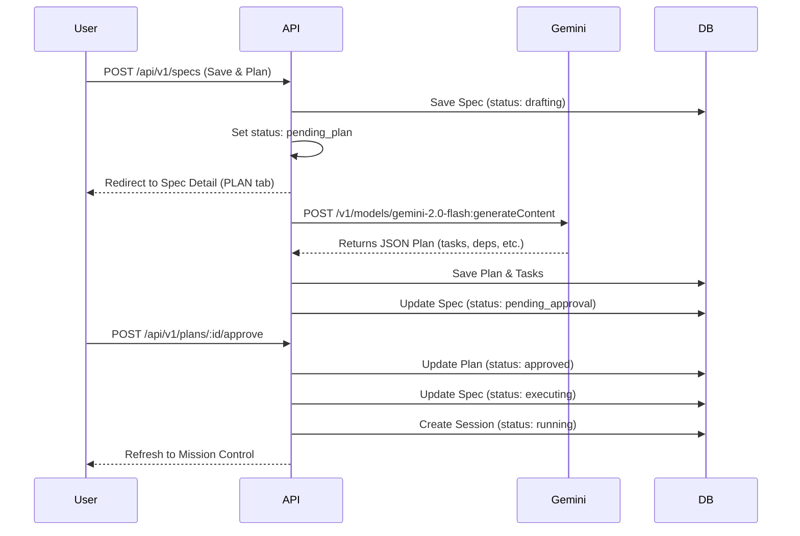
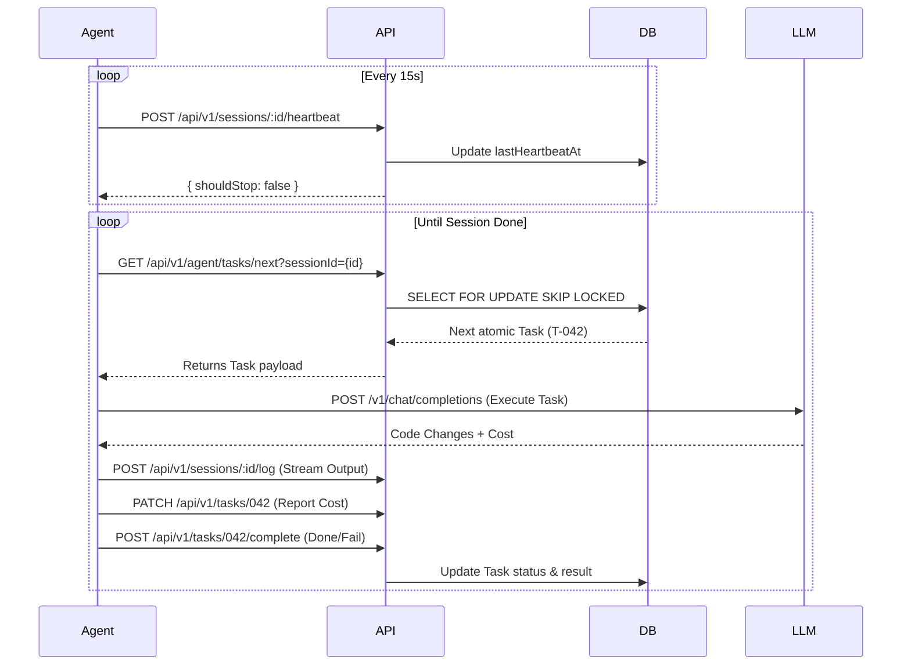
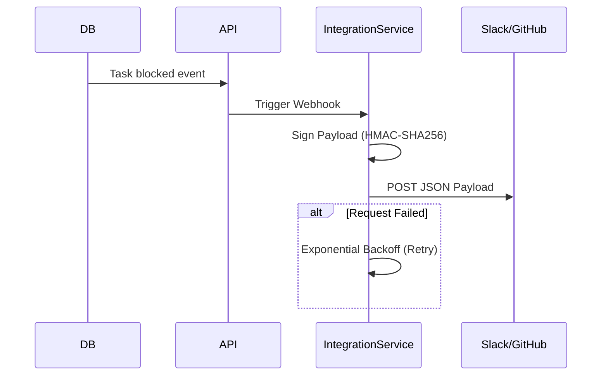

SPECDRIVR

Master Product Specification — Core Flow Diagrams

---

## 1. Overview

Use these Mermaid diagrams to understand core asynchronous operations in Specdrivr.

## 2. Specification-to-Execution Flow

This flow shows the lifecycle from a user specification save to an agent session start.

## 3. Agent Polling & Execution Loop

This flow shows communication between the standalone DAEMON agent and the API.

## 4. Webhook Integration Flow

This flow shows the outgoing notification system.

